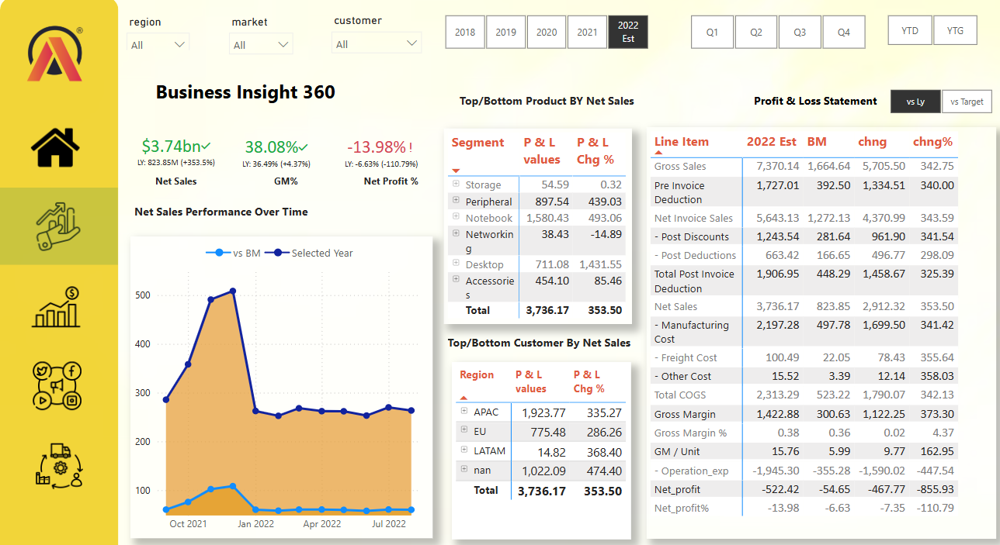

# 📊 Business insight 360 Dashboard

Account information for 10,000 customers at a European bank, including details on their credit score, balance, products, and whether they have churned.

---
# Sales & Profit Analysis Dashboard 📊

## Overview
This repository contains an in-depth **Sales & Profit Analysis Dashboard** that tracks and visualizes key performance indicators (KPIs), financial metrics, and customer data to provide actionable insights for improving business strategies. The dashboard leverages various chart types to represent data for easy interpretation, helping teams optimize operations and increase profitability.

## Key Metrics 📈

### 📊 **KPIs:**
- **Net Sales:** $3.74bn (+353.5% YoY)
- **Gross Margin % (GM%):** 38.08% (+4.37% YoY)
- **Net Profit %:** -13.98% (down from -6.63% YoY)
- **Forecast Accuracy:** 81.17% (vs 80.21% LY)

### 📋 **Metrics Breakdown:**
- **Top Segments by Net Sales:**
  - Notebook: $1.58bn
  - Desktop: $711.08m
  - Peripherals: $897.54m
- **Top Regions by Net Sales:**
  - APAC: $1.92bn
  - EU: $775.48m
- **Top Customers by Net Sales:**
  - Amazon: $496.88m
  - AltiQ Exclusive: $307.17m

### 🎨 **Visual Insights:**
- **Line Chart:** Tracks Net Sales performance over time, showcasing consistent growth with a dip towards late 2022.
- **Bubble Charts:** Highlight regions like USA and India, which contribute significantly to revenue with high gross margins.
- **Pie Charts:**
  - Gross Margin contributes ~38% of Net Sales.
  - COGS consumes ~62% of Net Sales.
- **Bar Graphs:**
  - Largest Profit Impact: High operation expenses (~$1.9K loss).
  - Gross Margin showed a slight increase, but Net Profit remains impacted by operational inefficiencies.

## Key Insights 🔑
- **Strong sales growth** in major markets (APAC & EU).
- **Improved Gross Margin** reflects better operational efficiencies.
- **Net Profit remains negative** due to high operational expenses despite better sales and margins.
- **Inventory Risks** in some segments (e.g., Accessories & Storage) show either out-of-stock or excess inventory.
- **Forecast Accuracy** is stable, but customer performance varies significantly (e.g., underperformance from Zone, Unity Stores).

## Recommendations 🛠
1. **Cost Optimization:** Focus on reducing operating expenses to improve profit margins.
2. **Inventory Management:** Address inventory risks by better stock balancing to avoid stockouts and overstocking.
3. **Customer-Specific Strategies:** Focus on low-performing customers with targeted support or renegotiation strategies.
4. **Product Focus:** Invest further in top-performing segments like Notebooks and Peripherals.
5. **Geographical Focus:** Strengthen presence in APAC and expand efforts in EU for continued growth.

- **Data_source** [maven_analytics](https://app.mavenanalytics.io/datasets?search=churn)
